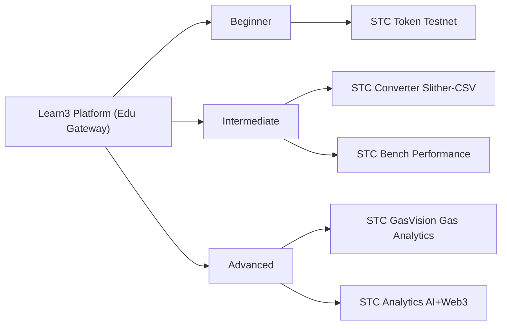
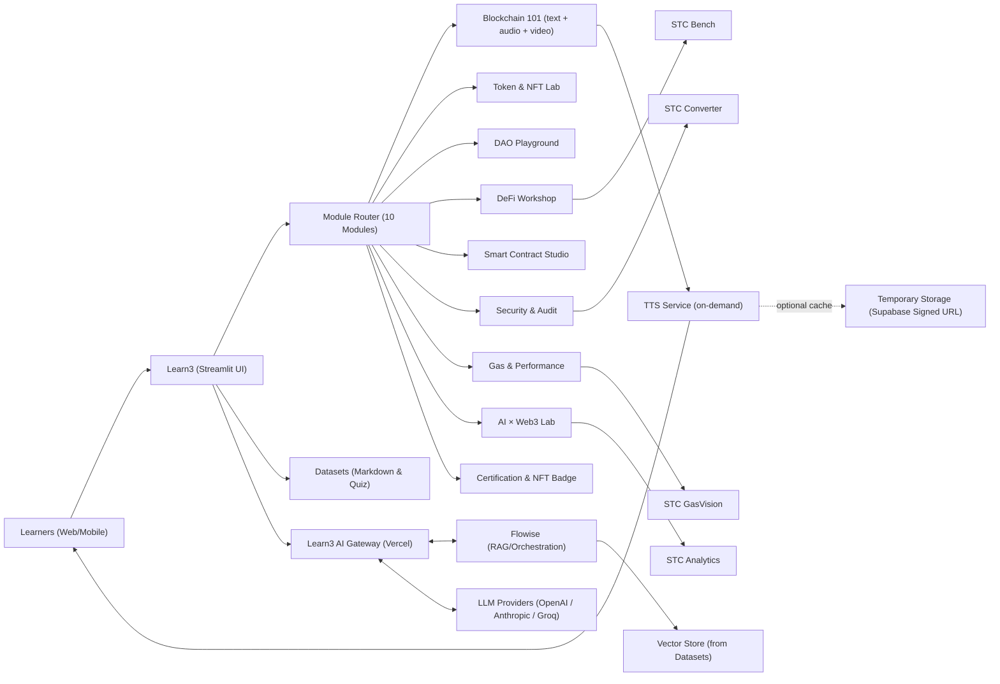

# Learn3 🚀

[](LICENSE)


**Learn3** adalah platform edukasi interaktif untuk memahami **Blockchain & Web3** secara bertahap (Beginner → Intermediate → Advanced).  
Didesain sebagai **AI-powered learning gateway**, Learn3 menggabungkan:  
- 📚 Dataset kurasi (Markdown & Quiz)
- 🤖 Chatbot mentor interaktif (Flowise + Vercel AI Gateway)
- 🎧🎥 Multi-format learning di **Blockchain 101** (teks + audio on-demand + video intro)
- 🧪 Case study nyata dengan **STC Ecosystem**

---

## 🎯 Visi

Menjadi **poros pembelajaran Web3** berbasis AI + dataset terbuka, yang bisa diakses mahasiswa, developer pemula, maupun komunitas.  

---

## 🧩 Modul Utama

1. **Chatbot Mentor AI 🤖** — QnA interaktif berbasis dataset (Beginner → Advanced).
2. **Blockchain 101 📖🎧🎥** — konsep dasar + **Audio Lesson on-demand** + **Video intro**.
3. **Token & NFT Lab 🎨** — eksperimen ERC-20 & NFT di testnet (contoh: STC Token).
4. **DAO Playground 🗳** — simulasi governance & voting proposal.
5. **DeFi Workshop 💱** — AMM/Uniswap, liquidity pool, staking (skenario testnet).
6. **Smart Contract Studio ⚒️** — tulis & deploy kontrak (Remix/Hardhat, OpenZeppelin).
7. **Security & Audit 🔐** — reentrancy, best-practice, tools audit (case: STC Converter).
8. **Gas & Performance ⚡** — optimasi gas & benchmarking (case: STC GasVision & STC Bench).
9. **AI × Web3 Lab 🤖🔗** — integrasi agent/analytics (case: STC Analytics).
10. **Certification & NFT Badge 🎓** — quiz, evaluasi, **NFT badge** *Powered by STC*.
  
---

## 🌐 Learn3 — Web3 Learning Flow

### 1. Web3 Bot + Tutor (Level-Based Q&A)

🟢 Beginner → Apa itu blockchain, wallet, private key, transaksi, gas fee.

🟡 Intermediate → Smart contract, governance, bridging, basic DeFi.

🔴 Advance → Account abstraction, rollups, zk-tech, modular blockchain.

### 2. Simulators (Hands-On Experience)

🗳️ DAO Voter Simulator → Latihan voting proposal, memahami pro-kontra & dampak treasury.

💧 LP Simulator → Simulasi jadi Liquidity Provider, hitung risiko IL vs Fee, strategi CLMM.

### 3. BlockChat (General Knowledge)

- Tanya jawab cepat seputar:

- Bitcoin & Ethereum

- Wallet & transaksi

- Mining & konsensus

- Smart contract dasar

### 4. Research & Future Trends (Exploration Mode)

- Eksplorasi topik cutting-edge:

- Modular blockchain

- MEV (Maximal Extractable Value)

- zkML (zero-knowledge + machine learning)

- Mode riset mendalam dengan referensi akademik & tren terbaru.

### 5. AI Gateway (Free Exploration)

- Akses ke banyak model AI (GPT, Claude, Gemini, Llama, dll).

- Bisa tanya bebas seputar Web3, riset, coding smart contract, bahkan tren pasar.

---

## 🖼️ Preview


---

## 📚 Struktur Dataset



> **Format:**  
> - `.md` → materi + contoh kode + analogi.  
> - `.json` → bank soal untuk quiz mode.  

---

## 📖 Tabel Modul Pembelajaran
| Level            | Modul                                                                    | Isi Utama                       | STC Case Study                                                   |
| ---------------- | ------------------------------------------------------------------------ | ------------------------------- | ---------------------------------------------------------------- |
| 🟢 Beginner      | Blockchain Basics, Wallet, Token & NFT, DAO & DeFi Intro                 | Konsep dasar + analogi          | Contoh ERC-20: **STC Token (testnet)**                           |
| 🟡 Intermediate  | Solidity, Deploy ERC-20, DAO Voting, DeFi (Uniswap), NFT Minting         | Praktik hands-on + snippet kode | **STC Converter** (security), **STC Bench** (DAO & performa)     |
| 🔴 Advanced      | Smart Contract Security, Upgradeable, Cross-chain, AI × Web3, Tokenomics | Best practice + tren riset      | **STC GasVision** (gas analysis), **STC Analytics** (AI insight) |
| 🎓 Certification | Quiz + NFT Badge                                                         | Evaluasi & sertifikasi          | Badge: *Powered by STC*                                          |

---

## 🔗 Integrasi STC (Soft Branding)
Learn3 menyelipkan **STC Ecosystem** sebagai **case study nyata**, tanpa hard-selling:  
- **Beginner** → contoh token & NFT menggunakan *STC Token* (testnet).  
- **Intermediate** → praktik DAO & benchmarking → *STC Bench*, *STC Converter*.  
- **Advanced** → security & gas optimization → *STC GasVision*, *STC Analytics*.



---

## ⚡ Tech Stack
- **Flowise** → Chatbot engine, dataset connector.  
- **Vercel AI SDK** → multi-gateway LLM (OpenAI, Claude, Groq, dsb).  
- **Markdown Dataset** → basis materi belajar.  
- **On-Demand TTS** → audio lesson (Notebook LM / OpenAI TTS).  
- **Next.js** → untuk Library viewer + API endpoint.  

---

## 🛠️ Getting Started
1. Clone repo ini.
2. Pastikan punya `.env` untuk API key (LLM, TTS, dsb).  
3. Jalankan Flowise dengan koneksi ke dataset.  
4. Deploy Next.js ke Vercel → otomatis dapat multi-model support.

**Clone repo**
```bash
   git clone https://github.com/mrbrightsides/learn3.git
   cd learn3
```
**Install dependencies**
```bash
npm install
```
**Setup environment**
```bash
OPENAI_API_KEY=your_key_here
```
**Run development**
```bash
npm run dev
```
Akses di browser: http://localhost:3000

---

## 🎓 Roadmap
- [x] Struktur dataset (Beginner → Advanced).  
- [x] Draft system prompt Learn3.  
- [ ] Integrasi chatbot Flowise + Vercel AI.  
- [ ] Modul Quiz & Certification (NFT badge).  
- [ ] Audio lesson on-demand.  
- [ ] Weekly Insight pipeline.  
- [ ] Integrasi penuh STC ecosystem.  

---

## 🤝 Kontribusi
- Tambahkan materi baru di `/datasets`.  
- Buat quiz tambahan untuk tiap level.  
- Share ide modul baru (pull request welcome).  

---

## 📜 Lisensi
MIT — bebas digunakan untuk edukasi.  
